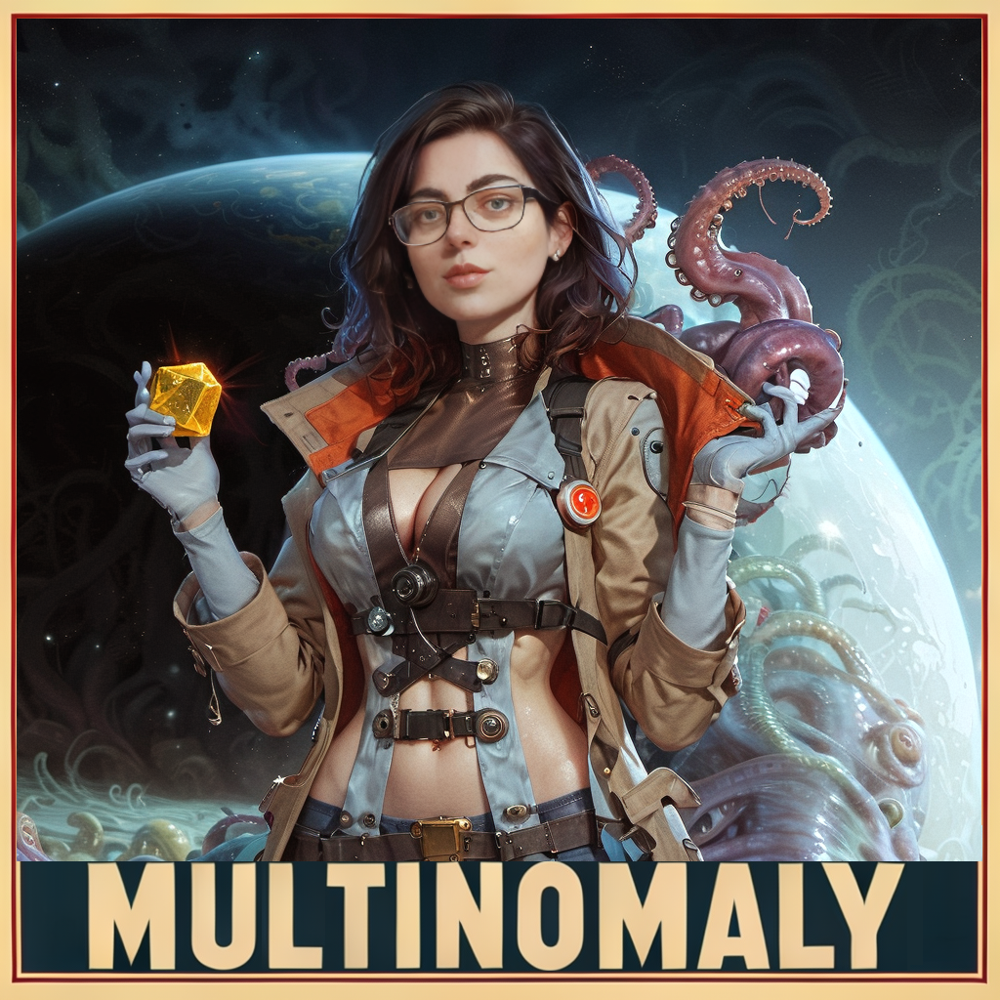

RimWorld 1.5 MultiNomaly Modpack
===


[](https://creativecommons.org/licenses/by-nc/3.0/)
[](http://rimworldgame.com/)

## Description

#### Status
Just starting off a fresh modpack for 1.5 Anomaly. The strategy this time is to begin with a minimal set of mods and slowly add a few as we play. Hopefully this will minimize desyncs as previous attempts to whittle down 100+ mods often was too much.

#### Versions
* Modpack Version: v0.1
* RimWorld Version: v1.5

#### DLCs:
* Royalty
* Biotech
* Ideology
* Anomaly (not tested yet, waiting for Zetrith's Multiplayer Mod to update before adding it)

#### Mods
* Zetrith's Multiplayer Mod
* Multiplayer Compat (haven't added this one yet)
* adding more slowly, check the changelog above

#### Team
Special thanks to GZ and Malki for patiently playtesting and debugging all these modpacks. May the desync gods smile upon us!

## Installation

1. Click `Subscribe to all` on the  [Mod Collection](https://steamcommunity.com/sharedfiles/filedetails/?id=3234578087) (like and favorite if you choose)
2. Download the [latest config files here](https://github.com/ubergarm/rimworld-mp-multinomaly/archive/master.zip)
3. Copy/paste the `Config` and `HugsLib` folders from the zip replacing yours e.g. `C:\Users\%USERPROFILE%\AppData\LocalLow\Ludeon Studios\RimWorld by Ludeon Studios\Config` or in Linux `~/.config/unity3d/Ludeon Studios/RimWorld by Ludeon Studios/Config`
4. Workshops mods constantly change so pin them by zipping `~/.steam/steam/steamapps/workshop/content/294100/*` and vendoring it to clients to unzip into `~/.steam/steam/steamapps/common/RimWorld/Mods/`. Don't use the "make local copies" as it messes up the mod names and patches are not properly applied.
   To find the dir to put the mods windows go to `Steam -> Library ->Rimworld -> Gear -> Manage -> Show Folder` will be something like `D:\mySteamGames\steamapps\common\RimWorld\Mods` or whatever you use...

You can skip step 4, but it may be possible mod updates will break the MP compat of the pack during a long playthrough.
Once you are using local versions of the mods, just ignore the mod manager notes about updated versions.

## Testing
Start up an MP server and connect to yourself by starting a second copy
of RimWorld.
```bash
LC_ALL=C ~/.local/share/Steam/steamapps/common/RimWorld/RimWorldLinux -logfile /tmp/rimworld_test_client_log
```

## Development
Copy all configs in linux here:
```bash
./update.sh
```

## References
* [RimWorld MultiNomaly Modpack Steam Workshop](https://steamcommunity.com/sharedfiles/filedetails/?id=3234578087)
* [RimWorld MultiNomaly GitHub](https://github.com/ubergarm/rimworld-mp-multinomaly)
* [RimWorld Multiplayer Discord Compatibility Spreadsheet](https://docs.google.com/spreadsheets/d/1jaDxV8F7bcz4E9zeIRmZGKuaX7d0kvWWq28aKckISaY/edit#gid=1144921800)
* [RimWorld Multiplayer Discord](https://discord.gg/S4bxXpv)
* [RimWorld Zetrith's Multiplayer Mod](https://rimworldmultiplayer.com/)
